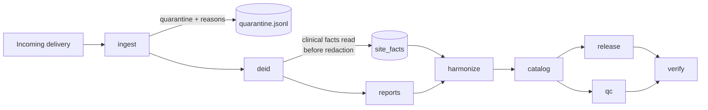

# cxr-harmony

A reproducible pipeline for ingesting, de-identifying, harmonising and versioning
chest-radiograph datasets contributed by multiple clinical partner sites with
divergent conventions.

[](https://github.com/SamarjeetMalik/cxr-harmony/actions/workflows/ci.yml)

> **The demonstration corpus is synthetic.** No patient data is used, contained or
> distributed by this repository. The generator in `src/cxr_harmony/synth/`
> fabricates DICOM studies carrying realistic-looking identifiers — names, MRNs,
> national health IDs, burned-in pixel annotation — precisely so that the
> de-identification stage has something real to remove. Public chest X-ray corpora
> are already de-identified, which makes them useless for demonstrating a
> de-identifier.

```bash
pip install -e ".[dev]" && make demo
```

That command generates a three-site delivery and runs the whole pipeline over it,
finishing with an independent verification pass. It takes about 40 seconds.

---

## The problem

Three hospitals contribute chest radiographs to a shared cohort. They record the
same clinical facts, and no two record them the same way:

| | Site A | Site B | Site C |
|---|---|---|---|
| Projection | `ViewPosition` = `PA` | empty tag; buried in free-text `SeriesDescription` | legacy beam arrow `P->A` |
| Study date | DICOM `DA` | `DD-MM-YYYY` in a private block | DICOM `DA` |
| Sex | `M` / `F` | `MALE` / `FEMALE` | HL7 numerics `1` / `2` |
| Labels | `ImageComments` | sidecar CSV, abbreviated (`CM`, `PE`) | report prose only |
| Burned-in text | none | 85% of images | 35% of images |

Every one of those is a convention real contributed archives exhibit. The HL7
numeric sex codes are the quietest hazard: `1` and `2` are valid strings that
nothing rejects, so an unconfigured reader produces a cohort with no usable sex
variable and no error.

## The pipeline



| Stage | What it does |
|---|---|
| `ingest` | Discovers, validates and indexes objects. Rejections go to a quarantine file **with a reason code**, never silently dropped. Copies no pixels. |
| `deid` | DICOM PS3.15 Annex E profile, keyed pseudonymisation, per-patient date shifting, UID remapping, burned-in text redaction. |
| `reports` | Sections report prose, scrubs PHI against the identifiers the header supplied, extracts labels with negation handling. |
| `harmonize` | Maps each site's conventions onto the canonical schema via a YAML adapter. Unmapped values are counted, not defaulted away. |
| `catalog` | Loads into SQLite with foreign keys enforced and three access roles. |
| `qc` | Integrity, completeness and cross-site distribution checks. |
| `release` | Content-addressed, immutable release with patient-level splits and a datasheet. |
| `verify` | Independent check of de-identification, the audit chain, and every release. Exits non-zero on failure. |

## Design decisions worth arguing with

**Clinical values are read before the profile destroys them.** The confidentiality
profile removes `SeriesDescription` and `ImageComments` because both routinely
carry names and dates. But site B encodes the projection in the first and site A
ships its labels in the second — so applying the profile first destroys the
content the cohort exists to hold. Extraction is therefore a separate step that
runs ahead of redaction, and its output carries no direct identifiers.

**Pseudonyms are keyed HMACs, not hashes.** The space of Indian MRNs, and even of
14-digit ABHA numbers, is small enough to enumerate. An unkeyed `sha256(mrn)` is
reversible by anyone willing to spend an afternoon, and several published
"anonymised" datasets have fallen exactly that way. Destroying the key makes the
mapping irreversible by construction — a property a data-sharing agreement can
actually require.

**Cross-site linkage runs on the national ID, and only on it.** Two hospitals
cannot be linked through local MRNs; those are independent sequences. Where both
record an ABHA, that is the only field on which one person's two records can be
recognised as one. Where it is absent, the pseudonym stays site-scoped and the
records stay separate — the conservative outcome, reported in QC rather than
guessed at.

**Burned-in text is found by edge density, not brightness.** On a chest
radiograph the spine, mediastinum and subdiaphragmatic region saturate to the
same value the text is drawn at, so a threshold finds the anatomy and misses the
name. Measured on the corpus at 128–1024 px, merged text lines score 0.55–1.00
edge density against 0.16–0.35 for non-text components — a wide empty gap to put
a threshold in. Redaction zeroes the region; blurring and pixelation are both
invertible often enough not to be relied on.

**Splits are per patient, and assigned by hash threshold.** A patient with a
baseline and two follow-ups contributes three studies; split them independently
and the same chest — same habitus, same old fracture, same implanted device —
sits in training and in test, inflating the score with nothing in a random-split
evaluation to reveal it. Assignment is by hash rather than shuffle because a
shuffle reassigns everyone when the cohort grows, so patients trained on last
quarter land in this quarter's test set. A threshold depends on the patient
alone.

**The verifier does not import the profile.** It checks output against the
requirement rather than against the implementation. A verifier sharing the
engine's notion of which tags matter will agree with it about a tag they both
forgot.

## What a run looks like

From `make demo` (48 patients, 74 studies, 512×512, seed 20260731):

```
Generated 74 studies for 48 patients across 3 sites
  8 patients were imaged at more than one site
Accepted 74 objects
De-identified 74 objects
  29 had burned-in annotation redacted
  8 patients linked across sites
Processed 74 reports
  1075 redactions applied
Harmonised 74 studies
    SITE_A: 29   SITE_B: 18   SITE_C: 27
All checks passed
Release v1.0.0  digest 09eb0d7e8963496b...
+----------------------------+
| Split | Patients | Studies |
| train |       27 |      40 |
| val   |       10 |      16 |
| test  |       11 |      18 |
+----------------------------+
De-identification: 74 objects checked
  no violations
  searched for 145 known identifier strings
Audit chain: intact
Release v1.0.0: verified
Verification passed
```

The linkage count matching the planted ground truth (8 of 8) is the load-bearing
number: it means the same person imaged at two hospitals under two different MRNs
collapsed to one identity, which is what makes the leakage-free split meaningful
across sites rather than only within one.

## Verification

Correctness claims here are tested, not asserted. 237 tests, and the ones that
matter most break something first — a QC check that has never been observed to
fail is not evidence of anything.

- **No identifier survives.** Every output header is re-read and searched for the
  exact identifier strings that went in. This is only possible because the corpus
  is synthetic and its ground truth is known; against real data you can verify
  structure but not that a particular name is gone, because you are not permitted
  to keep the list of names to search for. That is the argument for validating a
  de-identifier on generated data before pointing it at patients.
- **No pixel of burned-in text survives.** Asserted at pixel level, not by
  counting detections.
- **No patient appears in two splits.**
- **The same seed reproduces the corpus and the release byte for byte.**
- **The verifier can fail** — tampering tests reintroduce an identifier, break the
  audit chain, and corrupt a release manifest, and each is caught.

Coverage on `deid`, the module where a defect is a disclosure, is 94%.

## Governance

`docs/dpdp-controls.md` maps controls to obligations under India's DPDP Act 2023.
It is an engineering document, not legal advice, and it says so.

It also says plainly that **this output is pseudonymised, not anonymised**. A
keyed HMAC is reversible by whoever holds the key, so while the key exists the
release remains personal data and cannot be treated as outside the Act. Claiming
otherwise is the common and expensive error. Gaps the codebase does not address —
consent capture, breach notification, grievance redressal, and cross-border
transfer under s.16 — are listed rather than omitted.

The audit log is hash-chained. That is tamper-*evident*, not tamper-proof: anyone
who can write the file can rewrite the chain. It defends against the realistic
failure, which is one entry quietly edited months later.

## Adding a fourth site

Write `configs/sites/site_d.yaml` and run `harmonize`. No code change:

```yaml
site_id: SITE_D
view_position:
  patterns:
    - match: '\bAP\b'
      value: AP
    - match: '\bPA\b'
      value: PA
  default: UNKNOWN
sex:
  map: {"1": M, "2": F}
labels:
  source: sidecar_csv
  sidecar_file: findings.csv
  sidecar_key_column: accession
  sidecar_value_column: codes
  map: {NAD: NO_FINDING, CM: CARDIOMEGALY}
date_formats: ["%d/%m/%Y"]
```

Anything the config does not account for is counted in `unmapped_values.json` and
surfaced in the QC report, so a site that starts sending a new code becomes a
question to ask them rather than silent attrition.

## Limitations

Stated because they bear on whether any of this is usable, not for form's sake.

- **The label extractor's perfect score does not generalise.** It scores 1.000
  precision and recall over 151 synthetic reports, but the phrase bank and the
  report generator share an author, so that measures internal consistency. Real
  reports hedge ("cannot exclude", "possibly represents"), carry dictation errors,
  and vary by house style. On real prose a rule extractor of this shape would land
  far lower and would need scoring against radiologist adjudication before its
  output entered a training set. What the score does establish is narrow but real:
  the negation scope and the section restriction work, which is where this kind of
  extractor usually fails silently.
- **Burned-in text detection is tuned on synthetic overlays.** Real consoles use
  varied fonts, positions, rotations and semi-transparent overlays. The
  geometric approach should transfer, but the thresholds would need
  re-establishing against real films, and the failure mode is a missed name.
- **Access control is application-level.** It constrains the query helpers, not
  someone holding the SQLite file. That boundary is infrastructural.
- **No OCR fallback.** Text detection finds *where* characters are, not what they
  say, which is sufficient for redaction but means there is no audit trail of what
  was removed.
- **The synthetic images are not anatomically faithful.** Nothing here reads them
  diagnostically; they exist to make text detection a genuine problem rather than
  a trivial one.
- **Sequence recursion is shallow-tested.** The profile recurses into nested
  sequences, but the synthetic corpus contains few, so that path has less coverage
  than the top-level one.

## Layout

```
src/cxr_harmony/
  schema/       canonical models, vocabularies, JSON Schema export
  synth/        synthetic three-site corpus generator
  ingest/       discovery, validation, quarantine
  deid/         PS3.15 profile, pseudonymisation, pixel cleaning, verification
  reports/      sectioning, PHI scrubbing, rule-based labels
  harmonize/    YAML site adapters onto the canonical schema
  catalog/      SQLite catalogue, role-based access
  qc/           checks and reporting
  release/      content-addressed releases, leakage-free splits
  governance/   hash-chained audit log, DPDP mapping, verification
configs/sites/  one YAML per contributing site
```

## Licence

MIT.
