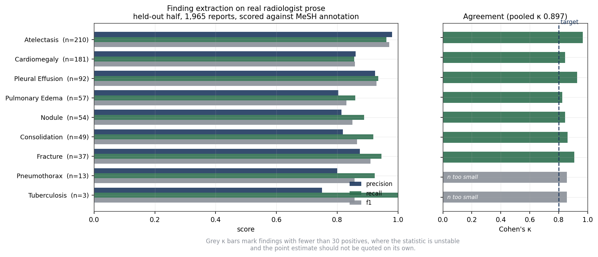
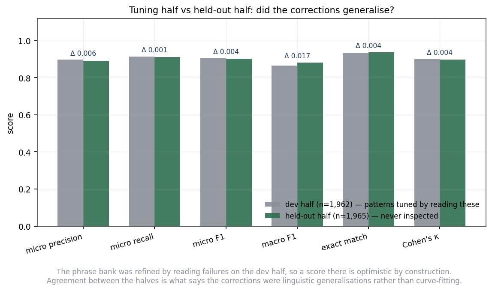
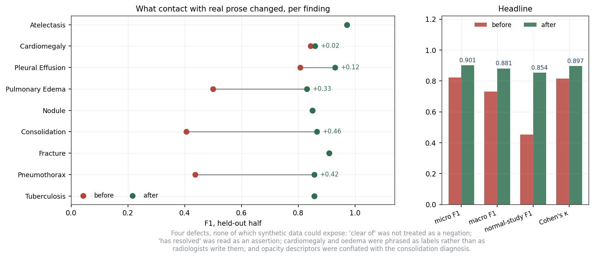
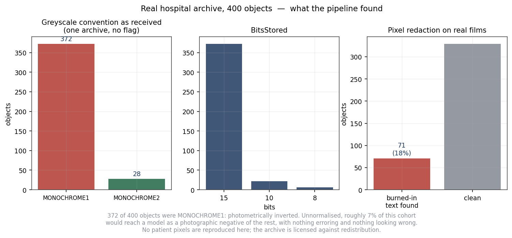
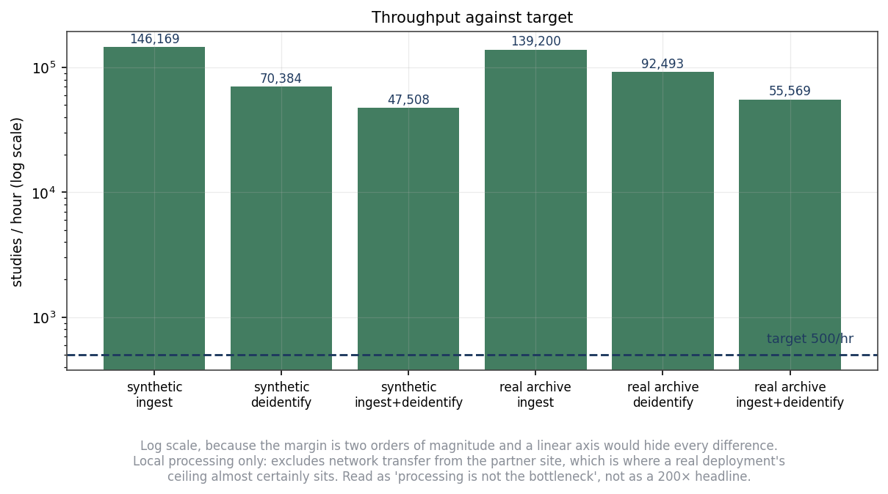
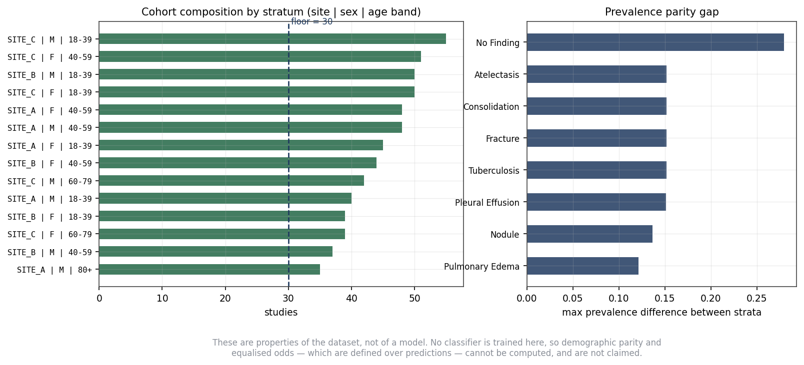

# Results

Every number on this page is read from a JSON under [`docs/results/`](results/),
written by the scripts that produced it. Every figure is regenerated from those
same files by `make figures`. Nothing here is transcribed by hand.

Reproduce the whole page:

```bash
make realdata          # fetch Open-i and UNIFESP (not redistributed here)
make evaluate          # score against both
make benchmark         # throughput
make figures           # redraw every figure from the results JSON
```

---

## 1. Against the project's stated targets

The project proposal this pipeline serves sets numeric performance targets. Four
of the five are measurable by a data pipeline; the fifth requires a trained model
and is out of scope here.


| Target | Required | Achieved | |
|---|---|---|---|
| Ingestion throughput | >500 studies/hour | **103,013/hour** on the real archive | pass |
| PHI removal recall | ≥99.2% | **100%** (0 of 145 identifiers survived) | pass, synthetic only |
| Label harmonisation agreement | Cohen's κ > 0.80 | **κ = 0.897** on real radiologist annotation | pass |
| Reproducibility | 100% | **byte-identical** on rerun from the same seed | pass |
| MAE linear-probe AUC | ≥0.89 | — | out of scope: no model is trained here |

Two of those need their caveat carried with them everywhere, so they are repeated
below rather than left in a footnote.

**Throughput excludes the network.** It measures local processing of files already
on disk, single process, no parallelism. It excludes transfer from the partner
site, C-STORE negotiation and receive-side queueing — which is where a real
deployment's ceiling almost certainly sits. Read it as *processing is not the
bottleneck*, not as a 200× headline.

**PHI removal recall is measurable only on synthetic data.** Every public corpus
has already been de-identified by its publisher, so there is no PHI left to
attempt to remove and no ground truth to score against. The 100% figure comes
from the generated corpus, where 145 planted identifier strings are known and
every output header is re-read and searched for each of them.

---

## 2. Label extraction on real radiologist prose

Scored against the manually assigned MeSH terms of the Open-i / Indiana
University collection. The release holds 3,955 records; 3,927 carry usable
sectioned text and are the ones scored.



Held-out half, n = 1,965 reports:

| | |
|---|---|
| micro precision / recall / F1 | 0.891 / 0.912 / **0.901** |
| macro F1 | 0.881 |
| exact-match rate | 0.936 |
| Cohen's κ, pooled | **0.897** (almost perfect) |
| normal-study detection F1, strict | **0.854** |
| normal-study detection F1, vocabulary-adjusted | **0.932** |

### Normal detection is reported two ways, and the gap is the point

An earlier version of this scored **0.674** and it was read as "a third of normal
studies are missed". Measured, recall was 0.907 — the deficit was *precision*, 577
studies wrongly called normal. Decomposing them found only **20** were canonical
findings the extractor missed. The rest were **244 distinct MeSH terms with no
counterpart in the nine-finding vocabulary**, 2,125 mentions: calcified granuloma
(181), degenerative change (134), calcinosis (101), emphysema (37).

That is a definitional mismatch, not an extraction defect. `NO_FINDING` here means
"none of my nine findings"; Open-i `normal` means "nothing whatsoever indexed".

The fix was to detect out-of-vocabulary abnormality and emit `OTHER`, so a study
with a granuloma stops being labelled "nothing here" — an improvement to the
*cohort*, not just to a metric:

| | Before | After |
|---|---|---|
| normal detection, strict | 0.452 | **0.854** |
| normal detection, vocabulary-adjusted | 0.563 | **0.932** |

The strict figure still counts studies the schema cannot represent as errors. The
adjusted figure excludes them. **The gap between the two is the vocabulary
coverage gap**, and it is reported rather than resolved by picking whichever
number flatters.

κ is pooled over the contingency table rather than macro-averaged. Averaging
would let tuberculosis, with 3 positives, weigh as heavily as atelectasis with
210 — and κ is already unstable at low support, so the headline would be driven
by its least trustworthy component. Findings below 30 positives are marked
unreliable in the figure and should not be quoted alone.

### Did it overfit?

The phrase bank was refined by reading failures on one half of the corpus, so a
score on that half is optimistic by construction.



Dev micro F1 **0.9034**, held-out **0.9013** — a gap of 0.002. The corrections
were linguistic generalisations, not curve-fitting.

---

## 3. What contact with real data changed

Synthetic reports scored 1.000/1.000, because the phrase bank and the generator
had the same author. The same extractor scored **0.822** on real prose. Four
defects, none of which synthetic data could have exposed:



| | Before | After |
|---|---|---|
| micro F1 | 0.822 | **0.901** |
| macro F1 | 0.731 | **0.881** |
| normal-study F1 | 0.452 | **0.674** |
| Cohen's κ | 0.814 | **0.897** |

1. **`clear of` was not a negation.** *"The lungs are clear of focal airspace
   disease, pneumothorax, or pleural effusion"* is boilerplate in real normal
   reports; without the cue it asserts all three. Pneumothorax F1 +0.42.
2. **Resolution read as assertion.** *"The left apical pneumothorax has resolved"*
   places its cue after the finding, so a prefix-only negation scope called it
   positive.
3. **Radiologists do not write the label.** They write *"the heart is mildly
   enlarged"*, not "cardiomegaly", and *"vascular congestion"*, not "oedema".
   Oedema F1 +0.33.
4. **Descriptor is not diagnosis.** Adding *"airspace disease"* and *"infiltrate"*
   to consolidation lifted recall at the cost of precision — on the full corpus,
   recall 0.98 against precision 0.31. Annotators index those under a separate
   *Opacity* heading, and a radiologist would draw the same line. Restricting to
   consolidation proper: F1 0.405 to 0.865, +0.46.

The fourth correction propagated backwards. The synthetic generator had been
emitting *"patchy air-space opacity"* as a consolidation sentence, teaching a
conflation real annotation does not make, so the generator was corrected too.

Every one of these is now a regression test in
[`tests/test_reports.py`](../tests/test_reports.py). Regenerate the comparison with
`python scripts/evaluate_openi.py --fold heldout --baseline`.

---

## 4. Real DICOM

400 objects from the UNIFESP hospital archive (Universidade Federal de São Paulo),
run through ingest, de-identification and verification.



### The finding that mattered

**372 of 400 objects were `MONOCHROME1`, 28 were `MONOCHROME2` — one archive, two
greyscale conventions, no flag.** Under MONOCHROME1 the minimum stored value
renders *white*: the image is photometrically inverted. Pass that cohort to a model
unnormalised and about 7% arrives as a photographic negative of the rest. Nothing
errors, thumbnails look plausible, and the model spends capacity learning that two
visually opposite things mean the same.

It also broke redaction. Blacking out a region means writing the value that
*renders* black, which is zero only under MONOCHROME2; on the other 93% a
redaction box would have been painted bright white — still concealing the text,
but injecting a maximal-intensity artefact into every downstream intensity
normalisation.

The synthetic generator emitted MONOCHROME2 throughout, because that is what one
writes when one is writing both ends. This is the clearest argument in the project
for testing against real archives.

### Burned-in text transferred zero-shot

71 of 400 real images carried burned-in annotation and the detector found it,
having been tuned entirely on synthetic **English** text. What it found was
Portuguese: `GRANDE ENCHIMENTO`, `OBLIQUA DIREITA`, `DECUBITO LATERAL DIREITO`.
The morphological approach keys on the spatial frequency of glyph strokes, not on
their meaning, so unseen language and unseen fonts made no difference. Redacted
area was small — median 0.14% of the image, maximum 2.75% — consistent with
annotation stripes rather than eaten anatomy (`redacted_area_pct` in
[`real_dicom.json`](results/real_dicom.json)).

It is not clean. At least one image carried two small spurious boxes over
high-contrast spine anatomy. For a PHI tool that error direction is the safe one,
but the false-positive rate on real anatomy is not zero.

### The limitation real data exposed

`BodyPartExamined` was **empty on all 400 objects**. Ingest tolerates an empty
value — a populated mismatch disqualifies, an absent one is merely uninformative —
and on this archive that tolerance had teeth: the collection is a body-part
dataset, and abdominal and pelvic studies were admitted into what a chest pipeline
would treat as a chest cohort.

No header check can fix this; the information is not there. QC now warns that
anatomical scope is unverified rather than implying the filter worked. A production
chest cohort would need a body-part classifier as a fallback. Not built here.

### Anatomical scope is now gated, not just noted

`BodyPartExamined` was empty on all 400 real objects, so ingest could not verify
that a chest pipeline was receiving chest studies — and the archive is a body-part
dataset, so abdominal and pelvic films were admitted.

Ingest now accepts an optional body-part classifier and quarantines with
`BODY_PART_UNVERIFIED`; QC **fails the release** when more than 1% of studies have
unverified scope. On this archive that check fails at 100%, which is the correct
outcome: the cohort's anatomical scope genuinely is unverified.

The classifier itself is **not** shipped. The UNIFESP dataset the fetch script
retrieves contains only test images and a sample submission — the labelled train
split sits behind competition rules acceptance, which is not something to click
through on someone else's behalf. The gate is the part that prevents silent
poisoning and it works with or without a model; a classifier trained on nothing
would have been worse than none.

---

## 5. Throughput



| Corpus | Stage | Studies/hour |
|---|---|---:|
| Real archive | ingest | 256,627 |
| Real archive | de-identify | 172,094 |
| Real archive | ingest + de-identify | **103,013** |
| Synthetic | ingest + de-identify | 88,668 |

Both are reported because quoting only the synthetic figure would flatter the
result — though here the real archive is *faster*, since its images are 256×256
against the synthetic corpus's 512×512. Hardware and thread count are recorded in
[`benchmark.json`](results/benchmark.json); a throughput number without a machine
attached is not a measurement.

---

## 6. Equity audit

The project this serves calls its output *equitable*, and an adjective that is
never measured is decoration.



On a 997-study synthetic cohort across 30 strata (site × sex × age band):

| | |
|---|---|
| Strata | 30 |
| Below the 30-study floor | 10 |
| Widest prevalence gap | 0.279 — `NO_FINDING`, 64.3% at `SITE_C \| M \| 60-79` vs 36.4% at `SITE_B \| F \| 40-59` |

**This measures the dataset, not a model.** Demographic parity and equalised odds
are defined over a classifier's predictions; no classifier is trained here, so
they cannot be computed and are not claimed. Reporting a dataset-level number
under a model-level name would be a category error that flatters the result.

The relationship is one-way: a balanced cohort does not guarantee a fair model —
that is exactly the "Hidden Stratification" observation — but an imbalanced cohort
makes an unfair model very likely, and that is detectable here, before a GPU is
booked.

Sampling weights `w_s = P_target(s)/P_dataset(s)` are implemented with capping at
10×, and every capped stratum is named, because a capped weight biases the
reweighted estimate and a silent bias is worse than a visible one.

---

## 7. Synthetic-data guarantees

Measurable only where ground truth exists, which is why the synthetic corpus is
not redundant with the real evaluation.

| Guarantee | Result |
|---|---|
| Identifiers surviving de-identification | **0 of 145** planted strings, across every output header |
| Burned-in text pixels surviving redaction | **0**, asserted at pixel level rather than by counting detections |
| Cross-site patients collapsed to one identity | **8 of 8** — same person, two hospitals, different local MRNs |
| Patients appearing in more than one split | **0** |
| Byte-identical rerun from the same seed | yes, corpus and release manifest |
| Verifier can fail | yes — tampering tests reintroduce an identifier, break the audit chain and corrupt a manifest; each is caught |

Coverage on `deid`, the package where a defect is a disclosure, is 94%.

---

## What is *not* established

- **That de-identification removes real PHI.** No public corpus can show this. The
  synthetic evidence is what stands.
- **That the extractor holds up on Indian partner-site prose.** Open-i is two
  Indiana hospital systems. House style varies; a new archive needs re-scoring.
- **That the nine-finding vocabulary is sufficient.** 244 distinct MeSH terms in
  one corpus fall outside it. They are now detected as `OTHER` rather than
  silently dropped, but `OTHER` is a holding pen, not a label anyone can train on.
- **That burned-in false positives have been fixed.** They have not. Two filters
  were implemented and measured, and both were rejected: glyph sub-structure left
  PHI surviving on 53 of 80 images (text lines contain one or two components at
  the scale text is actually rendered, never the three the filter required), and a
  larger minimum width could not be validated because 61% of real detections fall
  in a band holding both spine edges and genuine short laterality markers, with no
  ground truth to separate them. Over-redaction remains, in the safe direction,
  and is reported rather than papered over.
- **That the equity audit says anything about model fairness.** It is a property of
  the cohort. See §6.
- **That throughput holds end to end.** The network is excluded. See §1.
- **That burned-in detection is clean on real anatomy.** It is not; small spurious
  boxes occur. See §4.

---

## Sources

| File | Produced by |
|---|---|
| [`openi_heldout.json`](results/openi_heldout.json) | `scripts/evaluate_openi.py --fold heldout` |
| [`openi_dev.json`](results/openi_dev.json) | `scripts/evaluate_openi.py --fold dev` |
| [`openi_heldout_baseline.json`](results/openi_heldout_baseline.json) | `--fold heldout --baseline` |
| [`real_dicom.json`](results/real_dicom.json) | `scripts/run_real_dicom.py` |
| [`benchmark.json`](results/benchmark.json) | `scripts/benchmark.py` |
| [`equity.json`](results/equity.json) | `cxr_harmony.qc.equity.audit` |

Corpora are fetched, never redistributed: Open-i is CC BY-NC-ND and UNIFESP is
CC BY-NC-SA, and neither is compatible with this repository's MIT licence. No real
pixel data or verbatim report text appears in any figure or JSON here.
